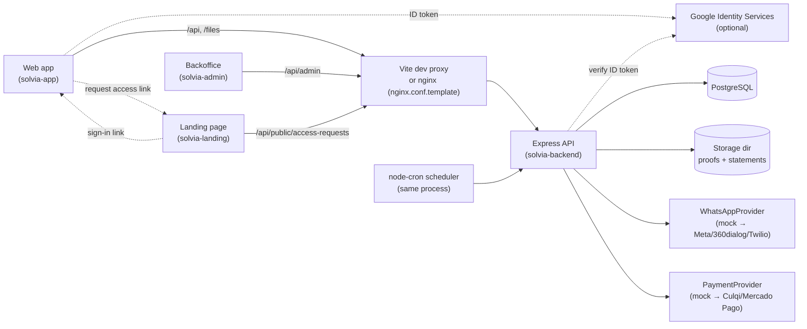
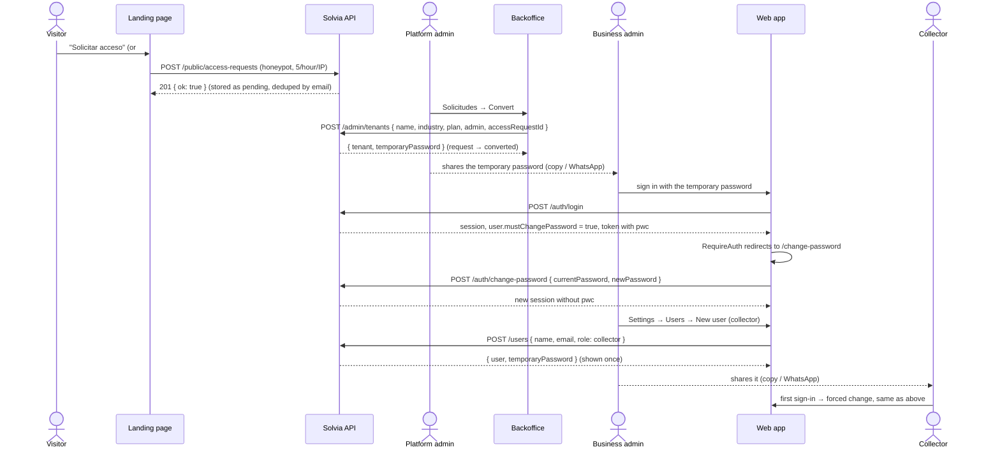
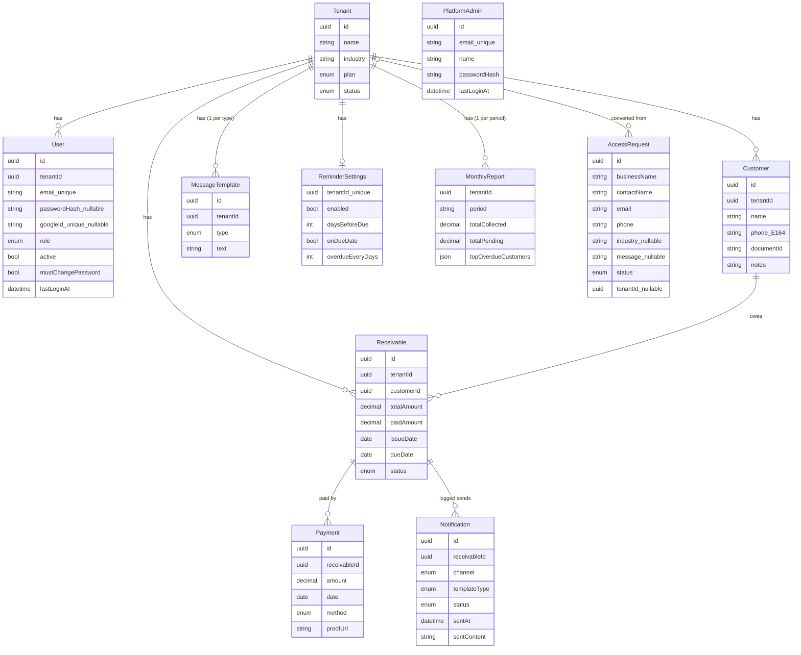

# Architecture: how Solvia works

This document explains how every part of Solvia fits together: the request lifecycle, multi-tenancy, authentication and managed onboarding, the platform backoffice, the data model, the business flows, the scheduled jobs and the frontends. Read it before changing core behavior.

- [1. System overview](#1-system-overview)
- [2. Backend layers](#2-backend-layers)
- [3. Request lifecycle](#3-request-lifecycle)
- [4. Multi-tenancy](#4-multi-tenancy)
- [5. Authentication and roles](#5-authentication-and-roles)
- [6. Platform backoffice](#6-platform-backoffice)
- [7. Data model](#7-data-model)
- [8. Business rules](#8-business-rules)
- [9. Main flows](#9-main-flows)
- [10. Scheduled jobs](#10-scheduled-jobs)
- [11. Providers (WhatsApp and payments)](#11-providers-whatsapp-and-payments)
- [12. Files and storage](#12-files-and-storage)
- [13. Errors and validation](#13-errors-and-validation)
- [14. Frontend architecture](#14-frontend-architecture)
- [15. Deployment topology](#15-deployment-topology)

---

## 1. System overview



- **Single backend process:** it serves the REST API (business routes, the public `/api/public` routes and the `/api/admin` backoffice routes) and also runs the cron scheduler (`src/server.ts`).
- **Four repositories:** `solvia-backend` (this API, the docs and the Compose files), plus three independent frontends: `solvia-app` (business web app), `solvia-admin` (platform backoffice) and `solvia-landing` (public landing page). Each frontend has its own dependencies, tooling, CI, Dockerfile and **its own copy of the UI kit** in `src/ui` (see [§14](#14-frontend-architecture)).
- **Same origin for the browser:** the frontends only call `/api/...` (and the web app `/files/...`) on their own origin. In development each project's Vite dev server proxies them (`vite.config.ts`); in Docker, nginx does (`nginx.conf.template`, upstream `API_UPSTREAM`). So CORS only matters if you host a frontend on a different domain without a proxy. The landing page's only API call is the public access request form.
- **External integrations** sit behind interfaces. Mocks are used by default, so the whole system runs offline. Google sign-in is optional and only active when `GOOGLE_CLIENT_ID` is set.

---

## 2. Backend layers

Each layer calls only the layer below it.

```
routes/        → HTTP wiring: path, middleware, OpenAPI annotations. No logic.
controllers/   → Parse and validate input with zod, call ONE service method, send the response.
services/      → Business logic and orchestration (transactions, providers, side effects).
repositories/  → Data access through the tenant-scoped Prisma client (platform/auth repos: basePrisma). No business rules.
domain/        → Pure functions (no I/O): status, risk score, reminder rules, cash flow, portfolio, templates,
                 Google sign-in decision, platform aggregations, temporary passwords, team-change rules.
lib/           → Infrastructure helpers: Prisma clients, tenant context, rate limiter, dates, money, logger.
```

Supporting folders:

| Folder        | Purpose                                                                                                                                                             |
| ------------- | ------------------------------------------------------------------------------------------------------------------------------------------------------------------- |
| `config/`     | `env.ts` validates `process.env` with zod at startup; `swagger.ts` builds the OpenAPI spec                                                                          |
| `middleware/` | `authenticate`, `authenticateAllowingPasswordChange`, `authenticatePlatformAdmin`, `requireRole`, `tenantScope`, `rateLimit`, `optionalProofUpload`, `errorHandler` |
| `validators/` | zod schemas for every input (body, params, query), including `passwordSchema`                                                                                       |
| `providers/`  | `WhatsAppProvider` / `PaymentProvider` interfaces, mocks and factories                                                                                              |
| `jobs/`       | Scheduler, job entry points and `runForEachTenant`                                                                                                                  |
| `errors/`     | `AppError(status, code, message, details?)` with helpers (`notFound`, `forbidden`, `unprocessable`...)                                                              |
| `database/`   | `seed.ts` (platform admin + demo data), `seedStress.ts` (one big tenant for load checks)                                                                            |
| `types/`      | Express `Request` augmentation (`req.auth`, `req.platformAuth`)                                                                                                     |

**Why this split?** Domain rules (risk score, reminder decisions, dashboard and platform aggregations) are the most valuable and most tested code, so they are pure functions in `domain/` that the unit tests exercise directly. Services turn database rows into domain inputs; `services/risk.service.ts` is the smallest example.

---

## 3. Request lifecycle

Example: `POST /api/receivables/:id/payments`.

```mermaid
sequenceDiagram
  participant C as Client
  participant A as app.ts (helmet, cors, json, morgan)
  participant R as routes/index.ts
  participant M as authenticate → tenantScope
  participant U as optionalProofUpload (multer)
  participant Ctl as receivable.controller
  participant S as payment.service
  participant Rep as repositories
  participant P as prisma (tenant-scoped)
  C->>A: HTTP request + Bearer token
  A->>R: /api/*
  R->>M: protected router
  M->>M: verify tenant JWT → req.auth; open tenant context
  M->>U: parse multipart (next bound to context)
  U->>Ctl: registerPayment
  Ctl->>Ctl: idParamSchema / createPaymentSchema .parse()
  Ctl->>S: paymentService.register(id, input, proof)
  S->>Rep: find receivable, create payment, update balance (transaction)
  Rep->>P: queries (tenantId injected automatically)
  S-->>S: fire-and-forget statementService.sendStatement()
  S->>Ctl: { payment, receivable } DTOs
  Ctl->>C: 201 JSON
  Note over A: Any thrown error → errorHandler → { error: { code, message, details? } }
```

Router order in `routes/index.ts`:

1. `GET /health` (public)
2. `/auth` (public except `/auth/me` and `/auth/change-password`, which use `authenticateAllowingPasswordChange`)
3. `/public` → `publicRouter` (unauthenticated landing endpoints; rate-limited; ends with its own `notFoundHandler`)
4. `/admin` → `platformRouter` (platform tokens; ends with its own `notFoundHandler`, so unknown admin paths never fall through to tenant routes)
5. everything else → `protectedRouter` with `authenticate, tenantScope` (includes `/users`, `/customers`, `/receivables`, `/settings` and the dashboard/report/notification routes)

Key points:

- **Express 5** forwards rejected promises from async handlers to the error handler, so controllers need no `try/catch` or `asyncHandler` wrapper.
- **Controllers never touch Prisma;** services never read `req`.
- **Responses are DTOs** built in `services/dto.ts`. Prisma `Decimal` becomes a `number` and dates become `YYYY-MM-DD` strings.

---

## 4. Multi-tenancy

**Every business is a tenant; a request can only ever see its own tenant's rows.** Isolation is enforced centrally, so individual queries cannot forget it.

### 4.1 Pieces

| Piece           | File                           | Role                                                                                                                                        |
| --------------- | ------------------------------ | ------------------------------------------------------------------------------------------------------------------------------------------- |
| JWT payload     | `services/token.service.ts`    | Tenant access token carries `sub` (user id), `tenantId`, `role`, `type: 'access'` and, while the user has a temporary password, `pwc: true` |
| `authenticate`  | `middleware/authenticate.ts`   | Verifies a **tenant** token (platform tokens are rejected), sets `req.auth`, and rejects tokens with `pwc` (`403 PASSWORD_CHANGE_REQUIRED`) |
| `tenantScope`   | `middleware/tenantScope.ts`    | `runWithTenant(req.auth.tenantId, next)`                                                                                                    |
| Tenant context  | `lib/tenantContext.ts`         | `AsyncLocalStorage`; `runWithTenant`, `getCurrentTenantId`, `requireTenantId`                                                               |
| Scoped client   | `lib/prisma.ts` → `prisma`     | Prisma query extension that applies the scope                                                                                               |
| Unscoped client | `lib/prisma.ts` → `basePrisma` | For auth, tenant creation, access requests, job orchestration, the platform backoffice and seed only                                        |

### 4.2 What the extension does

For each query on a scoped model:

| Model group                                                                                                       | Reads, updates and deletes (`where`) | Creates                                                                       |
| ----------------------------------------------------------------------------------------------------------------- | ------------------------------------ | ----------------------------------------------------------------------------- |
| `User`, `Customer`, `Receivable`, `MessageTemplate`, `ReminderSettings`, `MonthlyReport` (`DIRECT_TENANT_MODELS`) | adds `tenantId = <current>`          | sets `data.tenantId = <current>`                                              |
| `Payment`, `Notification` (`RECEIVABLE_SCOPED_MODELS`, no `tenantId` column)                                      | adds `receivable: { tenantId }`      | verifies the referenced `receivableId` belongs to the tenant, otherwise `404` |
| `Tenant`                                                                                                          | forces `id = <current>`              | rejected (use `basePrisma`)                                                   |

If there is **no tenant context**, the query throws `Tenant context is required to query model "X"`. The system is fail-closed.

`PlatformAdmin` and `AccessRequest` are **not** tenant-owned and are only accessed through `basePrisma` (`repositories/platformAdmin.repository.ts`, `repositories/accessRequest.repository.ts`). An access request exists before its business does. The cross-tenant reads of the backoffice live in `repositories/platform.repository.ts`, also on `basePrisma`. When the backoffice manages a business's users, `platform.service.ts` wraps the tenant-scoped `userManagementService` in `runWithTenant(tenantId, ...)` instead of querying users unscoped.

### 4.3 Rules for developers

1. **Scoped by default:** in repositories, always import `prisma` (scoped). Use `basePrisma` only when you truly work across tenants, and add a comment explaining why.
2. **Scalar foreign keys only:** write `{ customerId }` with `tenantId: requireTenantId()`, never nested `customer: { connect }`. Mixing both breaks Prisma's input types.
3. **Background work** (jobs, scripts) must run inside `runWithTenant(tenantId, fn)`. `jobs/tenantJobRunner.ts` does this for you (active tenants only).
4. **Callbacks that leave the async context** (stream events, some libraries) lose the tenant. Bind them with `AsyncResource.bind(fn)`, as `middleware/upload.ts` does for multer.
5. **Nested `include`s are not re-scoped:** they follow relations from an already-scoped parent. That is safe because relations never cross tenants. Never start a query from an unscoped model to reach tenant data.
6. **Raw SQL is never scoped:** `$queryRaw` bypasses the extension, even on the scoped client. Every raw query must filter by `requireTenantId()` itself (and join payments/notifications through `receivables`, since they have no `tenantId`). `repositories/analytics.repository.ts` does this for the dashboard aggregations, and `tests/analyticsRepository.test.ts` asserts it for each raw query (and fails if a new raw query is added without a check).

---

## 5. Authentication and roles

### 5.1 Tenant users

- **Tenant creation** always goes through `tenantRepository.createWithAdmin`, which creates in one transaction the tenant, the first **admin** user, the 4 default message templates and the default reminder rules. If an `accessRequestId` is given, it also marks that request `converted`. It is used by self-service sign-up, Google sign-up, the backoffice's `POST /admin/tenants` and the seed.
- **Self-service registration** (`POST /auth/register`) only works when `SELF_SIGNUP_ENABLED=true`. Otherwise it fails with `403 SIGNUP_DISABLED`, and businesses are created from the backoffice ([§5.4](#54-managed-onboarding)). `plan` is optional (default `free`), and the web app's form does not send it. `GET /auth/config` returns `{ googleClientId, signupEnabled }`, so the web app knows whether to show the sign-up tab.
- **Login** returns `{ user, accessToken, refreshToken }`, where `user` includes `mustChangePassword`. Passwords are hashed with bcrypt. Unknown emails (and Google-only accounts, whose `passwordHash` is `null`) still run a bcrypt comparison against a dummy hash, so response timing doesn't reveal whether an account exists. A successful password or Google sign-in updates `User.lastLoginAt`.
- **Password policy** (`passwordSchema` in `validators/auth.schemas.ts`): 8–128 characters, with at least one uppercase letter, one number and one special character. It applies to registration, password changes and the seeded platform admin password. Generated temporary passwords always satisfy it. The web app and the backoffice mirror it in `src/ui/components/passwordRules.ts` (`PASSWORD_RULES`, `meetsPasswordPolicy`) and show it with `<PasswordChecklist>`. **Keep the backend and both copies in sync.** Login only checks that a password is present, so older passwords keep working.
- **Who can sign in:** after the credentials are verified, `assertCanSignIn()` (`services/auth.service.ts`) rejects inactive users with `403 USER_DISABLED` and users of suspended tenants with `403 TENANT_SUSPENDED`. Login, refresh, Google sign-in and change-password all run it. Access tokens that were already issued stay valid until they expire.
- **Tokens:**
  - The access token (default 15 min) carries the tenant and role, plus `pwc: true` while the user has a temporary password ([§5.4](#54-managed-onboarding)).
  - The refresh token (default 7 days) is signed with a different secret. Refreshing re-reads the user, so the role and the `pwc` flag are always current.
  - Both are stateless (see [MAINTENANCE.md](MAINTENANCE.md#8-security-hardening-backlog)).
- **Frontend refresh:** on a `401`, the client created by `createApiClient()` (in each frontend's `src/ui/lib/http.ts`) calls the app's refresh path once (shared between concurrent requests) and retries the request. If the refresh fails, the user is logged out.
- **Email is globally unique,** so login doesn't need a tenant selector.

### 5.2 Sign in with Google

Optional, enabled by `GOOGLE_CLIENT_ID`.

1. The web app calls `GET /auth/config`. When `googleClientId` is not `null`, `GoogleSignInButton` loads Google Identity Services and renders Google's button on the sign-in page (and on the sign-up page when it is enabled). Otherwise it shows a disabled "Continue with Google" button with an "unavailable" note.
2. Google returns an ID token (`credential`), which the app posts to `POST /auth/google`.
3. `googleAuth.verify()` (`services/google.service.ts`) checks the signature, expiry and audience with `google-auth-library`, and only accepts verified emails (`GOOGLE_TOKEN_INVALID`, `GOOGLE_EMAIL_NOT_VERIFIED`, or `503 GOOGLE_NOT_CONFIGURED`).
4. `resolveGoogleSignIn()` (`domain/googleSignIn.ts`, pure and unit-tested) decides:

| Situation                                                | Result                                                                                                             |
| -------------------------------------------------------- | ------------------------------------------------------------------------------------------------------------------ |
| A user already has this `googleId`                       | `sign_in`                                                                                                          |
| A user has the same email and no `googleId`              | `link_and_sign_in` (stores `googleId`, then signs in)                                                              |
| A user has the same email and a `googleId`               | `sign_in`                                                                                                          |
| New email, self sign-up **disabled** (default)           | `account_not_found` → `403 GOOGLE_ACCOUNT_NOT_FOUND`                                                               |
| New email, self sign-up enabled, `businessName` provided | `register`: new tenant (plan `free`) + admin with `passwordHash = null`                                            |
| New email, self sign-up enabled, no `businessName`       | `{ needsRegistration: true, profile }`: the app asks for the business name (and optional industry) and posts again |

So with managed onboarding, Google only signs in (and links) users that a platform or business admin already created. The first Google sign-in of a user who still has a temporary password also carries `pwc`, so they still have to set a password first.

### 5.3 Roles

| Action                                                                                       | admin | collector      |
| -------------------------------------------------------------------------------------------- | ----- | -------------- |
| View and create customers, receivables and payments; send reminders and statements           | ✅    | ✅             |
| Delete customers or receivables                                                              | ✅    | ❌             |
| Edit or reset templates and edit reminder rules                                              | ✅    | ❌ (read-only) |
| Run the reminder engine now, generate a monthly report                                       | ✅    | ❌             |
| Manage the team (list, add, edit, deactivate users, reset their passwords): Settings → Users | ✅    | ❌             |
| Change their own password (`/change-password`)                                               | ✅    | ✅             |

Roles are enforced on the backend with `requireRole('admin')` in the route files (`usersRouter.use(requireRole('admin'))` covers all of `/users`). The frontend only hides the buttons and the Users tab (`useAuth().isAdmin`).

### 5.4 Managed onboarding

With `SELF_SIGNUP_ENABLED=false` (the default), nobody creates their own business. The Solvia team onboards it, and the business admin onboards their team:



**Access requests** (`services/accessRequest.service.ts`, `controllers/public.controller.ts`, `routes/public.routes.ts`):

- `POST /public/access-requests` takes `{ businessName, contactName, email, phone, industry?, message?, website }`, validated by `createAccessRequestSchema`.
- `website` is a **honeypot**. If it has a value, the controller answers `201 { ok: true }` without storing anything.
- If a **pending** request already exists for the email, the new one is accepted silently and not stored, so the form never reveals which emails already applied.
- `rateLimit({ limit: 5, windowMs: 1 h })` (`middleware/rateLimit.ts` over `lib/rateLimit.ts`) is an in-memory sliding window per client IP. Over the limit it answers `429 TOO_MANY_REQUESTS` with a `Retry-After` header. It counts per process, and `req.ip` depends on `trust proxy` (1 hop).
- Statuses: `pending` → `converted` (only through `POST /admin/tenants` with `accessRequestId`) or `dismissed` (and back to `pending`). A converted request can't change (`400 ACCESS_REQUEST_CONVERTED`).

**Temporary passwords** (`domain/temporaryPassword.ts`, `newTemporaryPassword()` in `services/userManagement.service.ts`):

- `generateTemporaryPassword()` returns 12 characters from `node:crypto` `randomInt`. It always includes an uppercase letter, a lowercase letter, a digit and one of `!@#$%*?`, leaves out ambiguous characters (`0/O/o`, `1/l/I`) and is shuffled.
- Only the bcrypt hash is stored. The plain value is returned **once** in the create or reset response and never again. The frontends show it in `TemporaryPasswordDialog`, with copy and a `wa.me` share link whose message includes the sign-in URL and the email.
- Whenever a temporary password is set (new tenant admin, new team user, reset), `User.mustChangePassword` becomes `true`.

**Forced change at first sign-in:**

- `issueTokens()` adds `pwc: true` to the access token while `mustChangePassword` is set.
- `authenticate` rejects such tokens with `403 PASSWORD_CHANGE_REQUIRED`. Only `GET /auth/me` and `POST /auth/change-password` use `authenticateAllowingPasswordChange` and accept them.
- `authService.changePassword()`:
  - checks `currentPassword` (`401 INVALID_CREDENTIALS`). Google-only accounts without a password may omit it.
  - rejects reusing the same password (`400 PASSWORD_REUSED`)
  - runs `assertCanSignIn()`, stores the new hash, clears `mustChangePassword` and returns a fresh session without `pwc`
- The web app's `RequireAuth` redirects any route to `/change-password` while `user.mustChangePassword` is true. The same page is available from the user menu for a voluntary change.

### 5.5 Team management

`services/userManagement.service.ts` runs inside a tenant context and is shared by two callers:

| Caller                                       | Routes                                                                                                                                                         | `actorId`                  |
| -------------------------------------------- | -------------------------------------------------------------------------------------------------------------------------------------------------------------- | -------------------------- |
| Business admin (web app, Settings → Users)   | `GET/POST /users`, `PATCH /users/:id`, `POST /users/:id/reset-password`                                                                                        | the admin's user id        |
| Platform admin (backoffice, business detail) | `POST /admin/tenants/:id/users`, `PATCH /admin/tenants/:id/users/:userId`, `POST /admin/tenants/:id/users/:userId/reset-password` (wrapped in `runWithTenant`) | `null` (not a tenant user) |

- **Create** `{ name, email, role }`: `409 EMAIL_TAKEN` if the email exists anywhere. It returns `{ user, temporaryPassword }`.
- **Update** `{ name?, role?, active? }` (at least one): `checkUserChange()` in `domain/userManagement.ts` enforces two rules:
  - `CANNOT_MODIFY_SELF` (400): a user can't change their own role or deactivate themselves.
  - `LAST_ADMIN` (400): a change can't leave the tenant without an active admin.
- **Reset password:** `checkPasswordReset()` rejects resetting your own password (`CANNOT_MODIFY_SELF`); use change-password for that. The user gets a new temporary password and `mustChangePassword = true`.
- Unknown ids answer `404 USER_NOT_FOUND`, and `404 TENANT_NOT_FOUND` for an unknown tenant in the backoffice.
- **List:** admins first, then by name. It is a plain array of `TenantUser` (`id`, `name`, `email`, `role`, `active`, `mustChangePassword`, `hasGoogle`, `lastLoginAt`, `createdAt`).
- **Deactivation** (`active: false`) blocks login and refresh with `403 USER_DISABLED`, and keeps the user's history. Existing access tokens stay valid until they expire.

---

## 6. Platform backoffice

The backoffice (`solvia-admin`) lets Solvia staff watch and manage every business, onboard new ones and handle access requests. Backend code:

- `routes/platform.routes.ts`, `controllers/platform.controller.ts`, `validators/platform.schemas.ts`
- `services/platformAuth.service.ts`, `services/platform.service.ts` (which uses `userManagementService` and `accessRequestService`)
- `repositories/platform*.repository.ts`, `repositories/accessRequest.repository.ts`
- `domain/platform.ts`

### 6.1 Separate accounts and tokens

- Accounts are `PlatformAdmin` rows (not `User`s, not tenant-owned). The seed upserts one: `PLATFORM_ADMIN_EMAIL` / `PLATFORM_ADMIN_PASSWORD`, default `admin@solvia.app` / `Password123!`.
- `issuePlatformTokens()` signs tokens with the same secrets and lifetimes as tenant tokens, but with `type: 'platform_access' | 'platform_refresh'`, `scope: 'platform'` and audience `aud: 'solvia-platform'`.
- Verification is realm-strict (`verify()` in `token.service.ts`): the `type` must match, platform verification requires the audience, and tenant verification rejects **any** token that carries an audience. So a platform token never passes `authenticate`, and a tenant token never passes `authenticatePlatformAdmin`. `tests/platformTokens.test.ts` covers this.
- Login uses the same dummy-hash timing protection as tenant login and records `lastLoginAt`.

### 6.2 Endpoints

| Endpoint                                                                                                                            | What it returns or does                                                                                                                                                                                                                                                                                                                                                                                                                                                                                                                   |
| ----------------------------------------------------------------------------------------------------------------------------------- | ----------------------------------------------------------------------------------------------------------------------------------------------------------------------------------------------------------------------------------------------------------------------------------------------------------------------------------------------------------------------------------------------------------------------------------------------------------------------------------------------------------------------------------------- |
| `POST /admin/auth/login`, `POST /admin/auth/refresh`, `GET /admin/auth/me`                                                          | Platform session                                                                                                                                                                                                                                                                                                                                                                                                                                                                                                                          |
| `GET /admin/overview`                                                                                                               | `totals` (tenants, active, suspended, users, customers, receivables, outstanding, collected in the last 30 days, new tenants this month, `pendingAccessRequests`), `tenantsByPlan`, `signups` (12 months), `collections` (6 months), `topTenants` (5, by outstanding balance). With `from`/`to`/`granularity` (same rules as [§8.8](#88-period-analytics-analyticsts)) it also returns `period`, `periodTotals` (`collected`, `newTenants`, `payments` as `{ value, previous }`) and `periodSeries` (`{ bucket, collected, newTenants }`) |
| `GET /admin/tenants`                                                                                                                | Paginated rows: plan, status, users, customers, receivables, outstanding, collected in the last 30 days, last activity. Filters `search` (tenant name or any user's email), `plan`, `status`; `sortBy` `name` \| `createdAt` \| `outstanding` \| `customers` \| `users`                                                                                                                                                                                                                                                                   |
| `POST /admin/tenants`                                                                                                               | `{ name, industry?, plan? (default free), admin: { name, email }, accessRequestId? }` → `201 { tenant, temporaryPassword }`. It creates the business with its defaults and first admin (`mustChangePassword = true`), and marks the access request `converted`. Errors: `409 EMAIL_TAKEN`, `404 ACCESS_REQUEST_NOT_FOUND`, `400 ACCESS_REQUEST_CONVERTED`                                                                                                                                                                                 |
| `GET /admin/tenants/:id`                                                                                                            | The row plus `overdue` and its users (`TenantUser`: role, active, `mustChangePassword`, `hasGoogle`, `lastLoginAt`, created date)                                                                                                                                                                                                                                                                                                                                                                                                         |
| `PATCH /admin/tenants/:id`                                                                                                          | `{ plan?, status? }` (at least one); returns the updated detail. `404 TENANT_NOT_FOUND` for unknown ids                                                                                                                                                                                                                                                                                                                                                                                                                                   |
| `POST /admin/tenants/:id/users` · `PATCH /admin/tenants/:id/users/:userId` · `POST /admin/tenants/:id/users/:userId/reset-password` | Team management of that business ([§5.5](#55-team-management))                                                                                                                                                                                                                                                                                                                                                                                                                                                                            |
| `GET /admin/access-requests`                                                                                                        | Paginated, newest first. Filters `status` (`pending` \| `converted` \| `dismissed`) and `search` (business, contact, email or phone, case-insensitive)                                                                                                                                                                                                                                                                                                                                                                                    |
| `PATCH /admin/access-requests/:id`                                                                                                  | `{ status: 'pending' \| 'dismissed' }`. `404 ACCESS_REQUEST_NOT_FOUND`, `400 ACCESS_REQUEST_CONVERTED`                                                                                                                                                                                                                                                                                                                                                                                                                                    |

Balances use the same definition as the tenant dashboard (total minus paid of every non-paid receivable). Sorting by `outstanding` is done in memory because the balance is computed.

### 6.3 Effects of suspension

- Users of the tenant get `403 TENANT_SUSPENDED` on login, refresh and Google sign-in (the web app shows a translated message).
- `runForEachTenant` only iterates `status = 'active'` tenants (`tenantRepository.listActiveIds()`), so no reminders or monthly reports run for suspended tenants.
- Data is untouched; reactivating (`status: 'active'`) restores everything.

### 6.4 Onboarding from the backoffice

- **Nueva empresa** (`NewTenantModal`) can be opened empty from **Businesses** or prefilled from a request in **Solicitudes**. Prefilling copies the business name, industry, contact name and email, and the plan. The plan is the first word `free`, `starter` or `pro` found in the message (the landing form adds a `Plan de interés: <Plan>` line), and `free` when there is none.
- After it is created, `TemporaryPasswordDialog` shows the password once. Its WhatsApp message links to `${VITE_APP_URL}/login`, and closing it opens the new business's detail page.
- The **Solicitudes** page defaults to pending requests. Its row actions are: convert, open the business it was converted into, WhatsApp, email, dismiss, and restore a dismissed one.

---

## 7. Data model

Source of truth: `prisma/schema.prisma`. Tables use snake_case names via `@@map`.



Enums worth knowing: `TenantPlan` (`free`, `starter`, `pro`), `TenantStatus` (`active`, `suspended`), `UserRole` (`admin`, `collector`), `ReceivableStatus`, `PaymentMethod` (`yape`, `plin`, `cash`, `bank_transfer`), `MessageTemplateType`, `AccessRequestStatus` (`pending`, `converted`, `dismissed`).

User fields for onboarding:

- `active` (default `true`): inactive users can't sign in or refresh.
- `mustChangePassword` (default `false`): set whenever a temporary password is issued, and cleared by `POST /auth/change-password`.
- `lastLoginAt`: last successful password or Google sign-in.

`AccessRequest` is not tenant-owned. Its `tenantId` points to the business created from it and becomes `NULL` if that tenant is deleted (`onDelete: SetNull`). It is indexed on `(status, createdAt)` and on `email`.

Migrations (`prisma/migrations/`):

| Migration                           | Change                                                                                                                                                  |
| ----------------------------------- | ------------------------------------------------------------------------------------------------------------------------------------------------------- |
| `20260923120000_init`               | Initial schema                                                                                                                                          |
| `20260923190000_add_google_sign_in` | `users.googleId` (unique), `users.passwordHash` nullable                                                                                                |
| `20260924100000_add_platform_admin` | `TenantStatus` enum, `tenants.status` (default `active`), `platform_admins` table                                                                       |
| `20260925090000_managed_onboarding` | `AccessRequestStatus` enum, `users.active` (default `true`), `users.mustChangePassword` (default `false`), `users.lastLoginAt`, `access_requests` table |

Conventions:

- **Money:** `Decimal(12,2)`, or `(14,2)` for report totals. Convert with `toNumber()` and round with `roundMoney()` (`lib/money.ts`). Comparisons use a half-cent tolerance (`EPSILON = 0.005`).
- **Business dates** (`issueDate`, `dueDate`, `Payment.date`) are `@db.Date`. In JavaScript they are **UTC-midnight `Date`s** representing a calendar day. "Today" is always `todayInTimezone(env.APP_TIMEZONE)` (`lib/dates.ts`). Never use `new Date()` for business days.
- **Deletes cascade:** deleting a tenant removes everything it owns (its access request, if any, is kept with `tenantId = NULL`). Deleting a customer removes its receivables, payments and notifications.
- **`paidAmount` and `status` are denormalized** on `Receivable`, so lists and filters are fast. They are only changed by `paymentService.register`, `receivableService.update` and `receivableRepository.markOverdue`.
- **Risk score is not stored;** it is computed on read.

---

## 8. Business rules

All rules live in `src/domain/` and are covered by unit tests.

### 8.1 Receivable status (`receivableStatus.ts`)

```
paid     if paidAmount >= totalAmount
overdue  else if dueDate < today          (takes precedence over partial)
partial  else if paidAmount > 0
pending  otherwise
```

The status is recomputed whenever a receivable is created, updated or paid. The hourly job also moves `pending`/`partial` to `overdue` once the due date passes.

### 8.2 Risk score (`riskScore.ts`)

**How receivables are evaluated:**

- A receivable counts only if it is fully paid or already past due.
- For each one, the _settlement date_ is the date of the payment that completed the balance.

**Three signals, each 0–2 points:**

| Signal                                           | +1    | +2    |
| ------------------------------------------------ | ----- | ----- |
| On-time rate (settled on or before the due date) | < 80% | < 50% |
| Average days late                                | > 7   | > 30  |
| Currently overdue receivables                    | ≥ 1   | ≥ 3   |

**Result:** 0–1 points is **low**, 2–3 is **medium**, 4–6 is **high**. The thresholds are in `RISK_THRESHOLDS`.

### 8.3 Reminder decision (`reminderRules.ts`)

`determineReminder(candidate, rules, today)` returns `pre_due_reminder`, `due_reminder`, `overdue_reminder` or `null`:

| Situation                     | Sends when             | "Already sent" means                                                 |
| ----------------------------- | ---------------------- | -------------------------------------------------------------------- |
| Due in 1…`daysBeforeDue` days | `daysBeforeDue > 0`    | a pre-due send inside this window (so a changed due date re-arms it) |
| Due today                     | `onDueDate`            | a due-date send dated on the due date                                |
| Overdue ≥ `overdueEveryDays`  | `overdueEveryDays > 0` | an overdue send after the due date and less than N days ago          |

Paid receivables and `enabled = false` never send. "Last sent" only counts `status = sent`, so failed attempts are retried on the next run.

### 8.4 Cash-flow projection (`cashFlow.ts`)

- **Input:** the outstanding balance of every unpaid receivable, bucketed by the ISO week (Monday start) or calendar month of its due date.
- **Buckets:** `periods` buckets (1–24, default 8), starting with the current period.
- **Returned separately:** past-due amounts as `overdue`, and amounts due after the horizon as `later`.

### 8.5 Portfolio analytics (`portfolio.ts`)

Used by `GET /dashboard/summary` (and `monthlySeries` also by the backoffice):

- `agingBuckets(balances, today)`: outstanding amounts by how far past due they are (`AGING_BUCKETS`). An item may carry a `count` when it stands for several receivables (the dashboard passes balances already grouped per due date).
- `monthlySeries(items, today, months)`: amount and count per calendar month, ending with the current month.
- `topDebtors(balances, limit)`: customers with the largest open balance (in-memory version; the dashboard now ranks them in SQL, 6 customers).

The summary also returns `totals` (outstanding, overdue, collected this month vs the same day last month, all-time collected, overdue rate, due in the next 7 days, customers), `byStatus`, `aging`, `collectionTrend` (6 months), `topDebtors`, `riskDistribution` (customers per risk level), `overdueAlerts` (10) and `latestMonthlyReport`.

**Performance.** The dashboard never loads whole tables: `analytics.repository.ts` aggregates in PostgreSQL (open balances per due date, payments per day, debtors per customer) and the pure functions shape the small results. The risk distribution still scores every customer, but the only per-receivable input the score needs, the settlement date, is computed in SQL (window function over the payments), so no payment rows reach Node (`riskScoreFromOutcomes`, identical results to `calculateRiskScore`, covered by a test). With the stress tenant (1,000 customers, 15,000 receivables, 20,000 payments) the summary answers in about 100–150 ms and the cash flow in about 10 ms on a laptop.

### 8.6 Platform aggregations (`platform.ts`)

`monthlyCounts`, `monthlyAmounts`, `planBreakdown`, `tenantBalances`, `lastActivityAt`, `sortBy` (stable) and `topTenantsByOutstanding`; see [§6](#6-platform-backoffice).

### 8.7 Templates (`template.ts`)

`{{placeholder}}` tokens are replaced by variables; unknown tokens are left visible on purpose. `DEFAULT_TEMPLATES` holds the defaults (also used by `POST /settings/templates/:type/reset`), and `TEMPLATE_PLACEHOLDERS` documents the variables shown in the Settings UI.

### 8.8 Period analytics (`analytics.ts`)

`GET /dashboard/analytics?from&to&granularity` (tenant, any role) powers the period view of the dashboard: any month, quarter, year or custom range compared with the previous period. `GET /admin/overview` accepts the same parameters for platform-wide totals.

- **Period:** `from`/`to` are inclusive `YYYY-MM-DD` calendar days in `APP_TIMEZONE`. Defaults: `to` = today, `from` = first day of the month of `to` (month to date). `from > to` or a range longer than 3 years (`to` after `from` + 3 calendar years) → `400 VALIDATION_ERROR` (`validators/analytics.schemas.ts`).
- **Previous period:** the same number of days immediately before `from` (`previousPeriod`). Every KPI is a `Metric` `{ value, previous }`; averages and rates are `null` when their denominator is 0.
- **Granularity:** `day | week | month`; default `autoGranularity`: up to 31 days → day, up to 120 days → ISO week (buckets start on Monday), longer → month. Series are zero-filled, oldest first, and the first bucket is clipped to `from` (`bucketKeys`, `bucketStart`, `bucketSeries`).
- **How it is computed:** the repository returns rows **per calendar day** (payments by `date`, receivables by `issueDate` / `dueDate`, customers and notifications by the local day of their timestamp), always for [`previous.from`, `to`]. The domain functions split them into current/previous totals, buckets and weekdays (`sumWithin`, `weekdayTotals`, `isoWeekday`). Money is rounded to 2 decimals, rates (`collectionRate`, `paidAfterReminder`) to 4, averages (`averagePayment`, `averageDaysToPay`) to 2.
- **Dates in SQL:** `date` columns are compared with inline `DATE 'YYYY-MM-DD'` literals (`repositories/sql.ts`). Bind parameters made PostgreSQL switch to a generic plan after a few executions of the prepared statement (index scan + nested loop over years of payments, 4–8x slower); literals keep a plan per range. Timestamps are converted with `AT TIME ZONE 'UTC' AT TIME ZONE <APP_TIMEZONE>`.
- **Indexes** (migration `20260926090000_analytics_indexes`): `payments(date)`, `receivables(tenantId, issueDate)`, `customers(tenantId, createdAt)`, next to the existing `receivables(tenantId, dueDate)` and `payments(receivableId)`.

Response:

| Field       | Content                                                                                                                                                                                                                                                                                                                                                                                                                                                                                                                                                                                                              |
| ----------- | -------------------------------------------------------------------------------------------------------------------------------------------------------------------------------------------------------------------------------------------------------------------------------------------------------------------------------------------------------------------------------------------------------------------------------------------------------------------------------------------------------------------------------------------------------------------------------------------------------------------- |
| `period`    | `{ from, to, granularity, previous: { from, to } }`                                                                                                                                                                                                                                                                                                                                                                                                                                                                                                                                                                  |
| `kpis`      | `collected` (sum of payments dated in the period), `payments` (their count), `averagePayment`, `issued` / `receivablesIssued` (by `issueDate`), `dueInPeriod` (total of receivables due in the period), `collectionRate` (paid amount of those receivables / `dueInPeriod`), `averageDaysToPay` (payment date − issue date, averaged over the payments of the period), `newCustomers`                                                                                                                                                                                                                                |
| `snapshot`  | Current state, not period based: `outstanding`, `overdue`, `overdueRate` (as in the summary), `openReceivables`, `customers`, and open balances `{ amount, count }` for `dueToday`, `dueNext30Days` (due today to today + 30) and `overdueOver30Days` (due date more than 30 days ago)                                                                                                                                                                                                                                                                                                                               |
| `reminders` | `sent` / `failed`: notification attempts by status, bucketed by the local date of `Notification.sentAt` (the row is written when the message is attempted, so `sentAt` is also its creation time). `byType`: every `MessageTemplateType` with its sent and failed counts in the period (rows without a template type count only in the totals). `paidAfterReminder`: share of receivables with at least one **sent** reminder (`pre_due_reminder`, `due_reminder`, `overdue_reminder`; statements excluded) in the period that got a payment dated on the reminder day or within the 7 days after it; `null` if none |
| `series`    | `{ bucket, collected, issued, due, payments }` per bucket                                                                                                                                                                                                                                                                                                                                                                                                                                                                                                                                                            |
| `byMethod`  | Every `PaymentMethod` (`yape`, `plin`, `cash`, `bank_transfer`) with `amount` and `count`, sorted by amount                                                                                                                                                                                                                                                                                                                                                                                                                                                                                                          |
| `byWeekday` | ISO weekday of the payment date (1 = Monday … 7 = Sunday), all 7                                                                                                                                                                                                                                                                                                                                                                                                                                                                                                                                                     |
| `topPayers` | 8 customers with the largest payments in the period: `{ customerId, name, amount, payments }`                                                                                                                                                                                                                                                                                                                                                                                                                                                                                                                        |

---

## 9. Main flows

### 9.1 Register a payment

1. **Validate:**
   - The receivable exists in the tenant and is not already paid (`RECEIVABLE_ALREADY_PAID`).
   - The amount is at most the outstanding balance (`PAYMENT_EXCEEDS_BALANCE`).
   - The date is not in the future (`PAYMENT_DATE_IN_FUTURE`).
2. **Save the proof,** if any, via `storageService.savePaymentProof`, which returns `/files/proofs/<uuid>.<ext>`.
3. **Transaction:**
   - Create the `Payment`.
   - `paidAmount += amount`.
   - Re-check `paidAmount <= totalAmount`; this guards against concurrent payments and rolls back if violated.
   - Recompute the status.
4. **After commit (fire-and-forget):** `statementService.sendStatement(customerId, receivableId)` runs. It builds the PDF, stores it, sends the `statement` template with `{{statementUrl}}` and logs a `Notification`. Its failures are logged and never fail the payment.

### 9.2 Account statement PDF

`statementService.generatePdf(customerId)` uses pdfkit. The document contains:

- a brand band ("Solvia", "Account Statement", business name, date)
- the customer block
- a summary (billed, paid, outstanding, overdue)
- the receivables table
- the payment history
- page footers

`GET /customers/:id/statement` streams it inline; `POST /customers/:id/statement/send` stores it and sends it. A customer without receivables gets `NO_RECEIVABLES_TO_REPORT`.

### 9.3 Sending any WhatsApp message

Every message goes through `notificationService.sendWhatsApp()`:

1. It calls `provider.send(to, { type, text }, variables)`.
2. It writes a `Notification` row with the rendered content and `sent` or `failed`, even if the provider throws.

This is the one place where the send log is guaranteed. `GET /notifications` reads it, filtered by `receivableId`, `customerId` and/or `status`.

### 9.4 Payment links

`paymentProvider.createPaymentLink({ reference: receivableId, amount: outstanding, currency, ... })`. Links are created:

- on demand (`POST /receivables/:id/payment-link`)
- for every reminder, as `{{paymentLink}}`

If link creation fails, the reminder is still sent with an empty link.

### 9.5 Lists: filtering, sorting, pagination

- **Receivables** sort in the database (`sortBy`: `dueDate` default, `issueDate`, `totalAmount`, `description`, `status`, `customer` (customer name), `createdAt`).
- **Customers** sort by `name` (default) or `createdAt` in the database. `outstanding` and `risk` are computed, so when one of them is the sort key, or when the `risk` filter is used, the service loads every match, computes them, sorts/filters in memory and then paginates.
- `sortDir` defaults to `asc`. The web app keeps the sort, filters and page in the URL (`useUrlState`).

---

## 10. Scheduled jobs

`jobs/scheduler.ts` registers both jobs with node-cron, using the `APP_TIMEZONE` timezone and `noOverlap: true`. Nothing is scheduled when `JOBS_ENABLED=false`.

| Job            | Default cron          | Entry point             | What it does                                                                                                                                                                             |
| -------------- | --------------------- | ----------------------- | ---------------------------------------------------------------------------------------------------------------------------------------------------------------------------------------- |
| Reminders      | `0 * * * *` (hourly)  | `runReminderJob()`      | For each active tenant: `reminderService.runForCurrentTenant()` marks overdue receivables, evaluates candidates (unpaid, due within `daysBeforeDue` days or earlier) and sends reminders |
| Monthly report | `30 23 * * *` (daily) | `runMonthlyReportJob()` | Exits unless today is the last day of the month; otherwise `monthlyReportService.generateForCurrentTenant()` for each active tenant (upsert per `tenantId + period`)                     |

`runForEachTenant(jobName, task)` loads `tenantRepository.listActiveIds()` (suspended tenants are skipped) and runs each tenant inside `runWithTenant`. Errors are isolated per tenant.

Manual equivalents: `POST /api/reminders/run` and `POST /api/reports/monthly/generate` (admin only).

> ⚠️ The scheduler runs inside the API process. If you run **more than one backend replica**, enable jobs on only one of them (`JOBS_ENABLED=true` on a single instance); see [MAINTENANCE.md](MAINTENANCE.md#6-scaling).

---

## 11. Providers (WhatsApp and payments)

```
providers/whatsapp/WhatsAppProvider.ts   interface  send(to, template, variables) → { success, content, providerMessageId?, error? }
providers/whatsapp/MockWhatsAppProvider.ts          logs to console; fails for non-E.164 numbers
providers/whatsapp/index.ts              factory    createWhatsAppProvider(env.WHATSAPP_PROVIDER), exported singleton

providers/payment/PaymentProvider.ts     interface  createPaymentLink(request) → { url, externalId, provider, expiresAt? }
providers/payment/MockPaymentProvider.ts            returns https://pay.mock.solvia.dev/checkout/...
providers/payment/index.ts               factory    createPaymentProvider(env.PAYMENT_PROVIDER), exported singleton
```

Contract rule: **providers must not throw for delivery failures.** They return `success: false` with an `error` message. `notificationService` still catches unexpected throws. Selecting an unimplemented provider stops startup with a clear message.

How to add a real provider: [DEVELOPMENT_GUIDE.md](DEVELOPMENT_GUIDE.md#add-a-real-whatsapp-or-payment-provider).

---

## 12. Files and storage

- **Location:** `services/storage.service.ts` writes to `STORAGE_DIR` (`./storage` locally, a Docker volume at `/app/storage`):
  - `proofs/<uuid>.<ext>` for payment proofs (JPEG, PNG, WEBP or PDF, up to `MAX_UPLOAD_SIZE_MB`; other types get `INVALID_PROOF_TYPE`)
  - `statements/<uuid>.pdf` for generated statements
- **Serving:** `app.ts` serves the directory at `/files` without authentication; the random names make URLs unguessable.
- **What the database stores:** relative paths (`/files/...`), so they work behind any proxy. Links sent outside the app use `storageService.toAbsoluteUrl()` with `PUBLIC_API_URL`.

---

## 13. Errors and validation

- **Input validation:** controllers call `schema.parse(req.body | req.params | req.query)`. A `ZodError` becomes `400 VALIDATION_ERROR`, with `details: [{ path, message }]`.
- **Expected failures:** services throw `AppError` with a **stable code**: `new AppError(422, 'PAYMENT_EXCEEDS_BALANCE', 'English message')`, or a helper (`AppError.notFound('Customer')`, `AppError.forbidden()`...). Codes are part of the API contract: the frontends translate them, so never rename one without updating the translations.
- **`middleware/errorHandler.ts` maps everything to `{ error: { code, message, details? } }`:**

| Source                                        | Status / code                                                   |
| --------------------------------------------- | --------------------------------------------------------------- |
| `AppError`                                    | its own status and code                                         |
| `ZodError`                                    | 400 `VALIDATION_ERROR`                                          |
| Prisma `P2002` (unique) / `P2025` (not found) | 409 `CONFLICT` / 404 `NOT_FOUND`                                |
| `MulterError`                                 | 400 `UPLOAD_ERROR`                                              |
| Malformed JSON                                | 400 `INVALID_JSON`                                              |
| Unknown route                                 | 404 `NOT_FOUND`                                                 |
| Anything else                                 | 500 `INTERNAL_SERVER_ERROR` (logged with stack; details hidden) |

Domain codes currently thrown by services and middleware:

| Code                                                                                        | Status                       | Where                                                                   |
| ------------------------------------------------------------------------------------------- | ---------------------------- | ----------------------------------------------------------------------- |
| `UNAUTHORIZED`, `FORBIDDEN`, `NOT_FOUND`, `CONFLICT`, `BAD_REQUEST`, `UNPROCESSABLE_ENTITY` | 401, 403, 404, 409, 400, 422 | `AppError` helpers                                                      |
| `INVALID_CREDENTIALS`                                                                       | 401                          | tenant and platform login; wrong current password on change-password    |
| `EMAIL_TAKEN`                                                                               | 409                          | register, create user, create tenant                                    |
| `TENANT_SUSPENDED`                                                                          | 403                          | login, refresh, Google sign-in, change-password                         |
| `USER_DISABLED`                                                                             | 403                          | login, refresh, Google sign-in, change-password (`User.active = false`) |
| `SIGNUP_DISABLED`                                                                           | 403                          | `POST /auth/register` when `SELF_SIGNUP_ENABLED=false`                  |
| `GOOGLE_ACCOUNT_NOT_FOUND`                                                                  | 403                          | Google sign-in with an unknown email when self sign-up is disabled      |
| `PASSWORD_CHANGE_REQUIRED`                                                                  | 403                          | `authenticate`: any tenant route while the token carries `pwc`          |
| `PASSWORD_REUSED`                                                                           | 400                          | change-password with the same password                                  |
| `CANNOT_MODIFY_SELF` / `LAST_ADMIN`                                                         | 400                          | team management (`userManagement.service.ts`)                           |
| `USER_NOT_FOUND`                                                                            | 404                          | team management                                                         |
| `ACCESS_REQUEST_NOT_FOUND` / `ACCESS_REQUEST_CONVERTED`                                     | 404 / 400                    | `accessRequest.service.ts` (update status, convert)                     |
| `TOO_MANY_REQUESTS`                                                                         | 429                          | `middleware/rateLimit.ts` (public access requests)                      |
| `GOOGLE_NOT_CONFIGURED` / `GOOGLE_TOKEN_INVALID` / `GOOGLE_EMAIL_NOT_VERIFIED`              | 503 / 401 / 401              | `google.service.ts`                                                     |
| `RECEIVABLE_ALREADY_PAID`, `PAYMENT_EXCEEDS_BALANCE`, `TOTAL_BELOW_PAID`                    | 422                          | payment, receivable and reminder services                               |
| `PAYMENT_DATE_IN_FUTURE`, `DUE_BEFORE_ISSUE`                                                | 400                          | payment and receivable services                                         |
| `NO_RECEIVABLES_TO_REPORT`                                                                  | 422                          | `statement.service.ts`                                                  |
| `INVALID_PROOF_TYPE`                                                                        | 400                          | `middleware/upload.ts`                                                  |
| `TENANT_NOT_FOUND`                                                                          | 404                          | platform service                                                        |

- **Environment:** validated once in `config/env.ts`. Import `env` from there, never read `process.env` directly.
- **Frontend:** `ApiError` (each project's `src/ui/lib/http.ts`, exported from `@/ui`) exposes `status`, `code`, `message`, `details` and `fieldErrors`, a map from field path to message. `useErrorText()` turns errors into text in the current language: `message(error)` looks up `errors.codes.<CODE>` (falling back to the server message, then `errors.generic`), and `field(error, name)` returns the message for a form field (the English server message in English, `errors.fields.<name>` or a generic hint otherwise). Network failures surface as `NETWORK_ERROR`.

---

## 14. Frontend architecture

### 14.1 Three independent repositories

Clone them next to `solvia-backend`:

```
solvia-backend/   API, docs, docker-compose.yml + docker-compose.full.yml
solvia-app/       business web app       (Vite, port 5173, PWA)
solvia-admin/     platform backoffice    (Vite, port 5175, PWA)
solvia-landing/   public marketing page  (Vite, port 5174, no service worker)
```

There is **no workspace root, shared package or shared config** (see [MAINTENANCE.md §10](MAINTENANCE.md#10-repositories)). Each frontend repository has everything it needs:

- `package.json` + `package-lock.json`, with the same scripts: `dev`, `build`, `preview`, `typecheck`, `lint`, `lint:fix`, `format` and `format:check`, plus `icons` in the app and the backoffice
- `eslint.config.js`, `.prettierrc`, `.prettierignore`, `tsconfig.json` / `tsconfig.app.json` / `tsconfig.node.json`
- `.gitignore`, `.dockerignore` and `.github/workflows/ci.yml` (`npm ci`, `lint`, `format:check`, `build`)
- `vite.config.ts`, `index.html`, `public/`
- `Dockerfile` + `nginx.conf.template`, and `.env.example`
- a README written for a standalone repository
- **its own copy of the UI kit** in `src/ui`

Each project imports the kit as `'@/ui'`. The `@` alias points to `src/`, declared in both `vite.config.ts` (`resolve.alias`) and `tsconfig.app.json` (`paths: { "@/*": ["./src/*"] }`). Each project's `src/index.css` is:

```css
@import 'tailwindcss';
@import './ui/styles.css';
```

The kit lives under `src/`, so Tailwind finds its classes automatically and no `@source` line is needed.

### 14.2 The UI kit (`src/ui`, one copy per project)

| Area            | Exports                                                                                                                                                                                                                                                                                                                                                                            | Notes                                                                                                                                                                                                                                                                                                                                                                                                                                                                                                                                                     |
| --------------- | ---------------------------------------------------------------------------------------------------------------------------------------------------------------------------------------------------------------------------------------------------------------------------------------------------------------------------------------------------------------------------------- | --------------------------------------------------------------------------------------------------------------------------------------------------------------------------------------------------------------------------------------------------------------------------------------------------------------------------------------------------------------------------------------------------------------------------------------------------------------------------------------------------------------------------------------------------------- |
| UI kit          | `Button`, `IconButton`, `DataTable`, `Card`, `Badge`, `Avatar`, `Stat`, `ProgressBar`, `Alert`, `EmptyState`, `LoadingState`, `Skeleton`, `Spinner`, `Field`, `PasswordInput`, `SearchInput`, `SegmentedControl`, `Tabs`, `IndustrySelect`, `KpiCard`, `KpiRow`, `Modal`, `Popover`, `MenuItems`, `Page`, `PageHeader`, `PasswordChecklist`, `PreferencesControls`, `Reveal`, `cx` | `DataTable` is content-sized with internal scroll, sortable headers, pagination and column visibility persisted under `solvia.table.<key>`. `Modal` is a `<dialog>` with enter/exit animations (the entrance uses `backwards` fill so no transform remains afterwards) and becomes a bottom sheet on phones; its children only mount while open. `Popover` portals into the nearest open `<dialog>` (the browser top layer) or `document.body`, so menus work inside modals. `Page fill` makes the last child (usually a table) take the remaining height |
| Phone           | `PhoneInput`, `isValidPhone`, `formatPhone` (app and landing only; the landing exports `PhoneInput` and `isValidPhone`)                                                                                                                                                                                                                                                            | A country picker with SVG flags from `country-flag-icons`, loaded per country via `import.meta.glob(..., { query: '?no-inline' })`. Calling codes, as-you-type formatting and validation come from `libphonenumber-js/min`. Peru (`PE`) is the default and frequent countries are listed first; names come from `Intl.DisplayNames`. The value is E.164. The web app uses it in the customer form (and `formatPhone` in the customer list and detail), and the landing in the access request form                                                         |
| Team            | `TeamUsers`, `TemporaryPasswordDialog`                                                                                                                                                                                                                                                                                                                                             | The team table and forms (create, edit, activate/deactivate, reset) used by the web app's Settings → Users and the backoffice's business detail, plus the one-time password dialog (copy, WhatsApp share)                                                                                                                                                                                                                                                                                                                                                 |
| Feedback        | `FeedbackProvider`, `useFeedback()`                                                                                                                                                                                                                                                                                                                                                | Toasts (`toast.success/error`) and a promise-based confirm dialog                                                                                                                                                                                                                                                                                                                                                                                                                                                                                         |
| Password policy | `PASSWORD_RULES`, `meetsPasswordPolicy`                                                                                                                                                                                                                                                                                                                                            | Mirror of the backend `passwordSchema`                                                                                                                                                                                                                                                                                                                                                                                                                                                                                                                    |
| Brand           | `Logo`, `LogoMark`, `Mascot` (Bowl, with moods), `OwlFace`, `OWL`, `OWL_COLORS`                                                                                                                                                                                                                                                                                                    | `owlGeometry.ts` is mirrored by each project's `public/favicon.svg` and by the PDF header; keep them in sync                                                                                                                                                                                                                                                                                                                                                                                                                                              |
| Theme           | `ThemeProvider`, `useTheme`                                                                                                                                                                                                                                                                                                                                                        | `light` \| `dark` \| `system`, stored in `solvia.theme`, applied as `data-theme` on `<html>`. Each `index.html` has a pre-paint script that sets `data-theme` before React loads (no flash)                                                                                                                                                                                                                                                                                                                                                               |
| i18n            | `I18nProvider`, `createUseI18n<Messages>()`, `useUiI18n`, `uiEs`, `uiEn`, `LOCALES`, `useErrorText`                                                                                                                                                                                                                                                                                | Generic provider (locale stored in `solvia.locale`, Spanish default) with formatters (`fmt.money`, `fmt.compactMoney`, `fmt.number`, `fmt.percent`, `fmt.date`, `fmt.shortDate`, `fmt.dateTime`, `fmt.period`, `fmt.shortPeriod`). `messages.ts` also holds the API error-code translations                                                                                                                                                                                                                                                               |
| Charts          | `useChartColors`, `AXIS_TICK`, `CHART_HEIGHT`, `ChartTooltipCard`, `DonutChart`, `RankingBars`                                                                                                                                                                                                                                                                                     | Colors are read from CSS variables at runtime and follow the theme                                                                                                                                                                                                                                                                                                                                                                                                                                                                                        |
| API             | `createApiClient`, `createTokenStore`, `ApiError`, `buildUrl`, `errorMessage`                                                                                                                                                                                                                                                                                                      | Fetch wrapper: base URL `VITE_API_URL`, bearer token, JSON/FormData, `401` → shared refresh → retry, `api.public.*` for unauthenticated calls                                                                                                                                                                                                                                                                                                                                                                                                             |
| Hooks           | `useUrlState`                                                                                                                                                                                                                                                                                                                                                                      | Typed state kept in the query string (filters, sort, page)                                                                                                                                                                                                                                                                                                                                                                                                                                                                                                |
| PWA             | `pwaInstall`, `usePwaInstall`, `useCanOfferInstall`, `InstallAppChip`, `PwaInstallGuide`, `PwaUpdatePrompt`                                                                                                                                                                                                                                                                        | See [§14.6](#146-installable-app-pwa)                                                                                                                                                                                                                                                                                                                                                                                                                                                                                                                     |
| Styles          | `styles.css`                                                                                                                                                                                                                                                                                                                                                                       | Design tokens (light/dark values under `[data-theme]`, exposed to Tailwind via `@theme`), `.input`/`.label`, the motion system and reduced-motion overrides                                                                                                                                                                                                                                                                                                                                                                                               |

**Motion system** (`styles.css`): `animate-page-in` (every `Page`), `animate-pop-in`, `animate-fade-in`, `stagger-in` (children appear one after another), modal and toast `data-state="open" | "closing"` animations, bottom-sheet in/out, and `.reveal` / `.is-visible` (used by `<Reveal>` for scroll-in effects). Under `prefers-reduced-motion: reduce` the animations are disabled.

**Which kit files exist in which project:**

| Kit file(s) under `src/ui/`                                                                                                                  | app |          admin          |                     landing                     |
| -------------------------------------------------------------------------------------------------------------------------------------------- | :-: | :---------------------: | :---------------------------------------------: |
| `brand/` (`Logo`, `Mascot`, `OwlFace`, `owlGeometry`)                                                                                        | ✅  |           ✅            |                       ✅                        |
| `components/` `Button`, `cx`, `Display`, `Feedback`, `Form`, `Modal`, `Overlays`, `PreferencesControls`, `Reveal`                            | ✅  |           ✅            |                       ✅                        |
| `theme/ThemeProvider.tsx`, `lib/http.ts`, `styles.css`                                                                                       | ✅  |           ✅            |                       ✅                        |
| `i18n/` (`context`, `I18nProvider`, `locales`, `useErrorText`)                                                                               | ✅  |           ✅            |                       ✅                        |
| `i18n/messages.ts`                                                                                                                           | ✅  | ✅ (no `phone` strings) | ✅ trimmed (only `phone`, `prefs` and `errors`) |
| `index.ts`                                                                                                                                   | ✅  |           ✅            |    ✅ trimmed (only what the landing ships)     |
| `components/` `PhoneInput`, `phoneCountries` (deps `libphonenumber-js`, `country-flag-icons`)                                                | ✅  |            –            |                       ✅                        |
| `components/` `DataTable`, `IndustrySelect`, `KpiCard`, `Page`, `PasswordChecklist`, `passwordRules`, `TeamUsers`, `TemporaryPasswordDialog` | ✅  |           ✅            |                        –                        |
| `charts/`, `hooks/useUrlState.ts`, `pwa/`                                                                                                    | ✅  |           ✅            |                        –                        |

The split started from one kit: the app's and the backoffice's copies were identical, and every landing file except `index.ts` and `i18n/messages.ts` matched its counterpart. Since then the phone field was added to the app and the landing only, so the backoffice's `index.ts` and `i18n/messages.ts` now differ from the app's. The shared files, including `Overlays.tsx` and `styles.css`, still match. The landing has its own `IndustrySelect` in `src/access/`, outside the kit, which reads the landing's dictionaries. To see where the copies have drifted since, run `diff -rq solvia-app/src/ui solvia-admin/src/ui` from the folder that holds the clones, and the same against `solvia-landing/src/ui`.

**The trade-off of independence.** No shared package means each project builds, versions and deploys on its own, with no workspace tooling and no cross-repo releases. The cost is duplication: **a kit change must be made in every project that needs it**. Examples are a design token, a component fix, a new error-code translation or a password-policy change. See the checklist in [DEVELOPMENT_GUIDE.md](DEVELOPMENT_GUIDE.md#change-the-ui-kit-srcui). The copies are expected to drift a little (the landing's is a subset), but shared behavior such as error codes, password rules and tokens should be kept aligned on purpose.

### 14.3 Web app (`solvia-app`)

```
main.tsx            ThemeProvider → I18nProvider → QueryClientProvider (no retries on 4xx) → BrowserRouter
                    → AuthProvider → FeedbackProvider → App + PwaManager
App.tsx             PublicOnly (/login, /register) · RequireAuth → /change-password and AppShell (/, /customers,
                    /customers/:id, /receivables, /settings, /help, 404)
lib/api.ts          createApiClient({ tokens: tokenStorage, refreshPath: '/auth/refresh' })
lib/config.ts       LANDING_URL (VITE_LANDING_URL), REQUEST_ACCESS_URL (#solicitar-acceso), APP_LOGIN_URL
lib/types.ts        TypeScript mirrors of the API DTOs
auth/               tokenStorage (createTokenStore('solvia') → localStorage "solvia.*"), AuthContext
                    (login, register, googleSignIn, changePassword, logout, isAdmin), RequireAuth / PublicOnly
hooks/queries.ts    one React Query hook per endpoint + queryKeys + cache invalidation (incl. team users)
i18n/               I18nProvider + typed useI18n; messages/es.ts (source of truth) and en.ts
components/layout/  AppShell (sidebar collapse in solvia.sidebar.collapsed), Sidebar, Topbar (user menu:
                    settings, change password, "Install as an app", logout), BottomNav, navItems,
                    AssistantMenu (Bowl), PwaManager
components/domain/  Badges, Customer/Receivable/Payment form modals, receivableColumns, useReceivableActions
components/charts/  CashFlowChart, TrendChart, AgingStrip
components/auth/    GoogleSignInButton (Google Identity Services)
tour/               TourProvider (guided tour, welcome modal, seen flag per user) and steps
pages/              AuthPages (LoginPage, RegisterPage, ChangePasswordPage), Dashboard, Customers,
                    CustomerDetail, Receivables, Settings (tabs: reminders, templates, log, users (admin), preferences),
                    UsersTab (TeamUsers wired to /users), Help
```

Managed-onboarding behavior:

- **Sign-in page:** the "Crear cuenta" tab appears only when `GET /auth/config` returns `signupEnabled: true`. Otherwise the page shows "¿Aún no tienes cuenta? **Solicita acceso**", linking to `${VITE_LANDING_URL}/#solicitar-acceso`, and `/register` redirects to `/login`.
- **Forced password change:** `RequireAuth` redirects every authenticated route to `/change-password` while `user.mustChangePassword` is true. The page asks for the temporary password and a new one (with the password checklist), then stores the new session returned by `POST /auth/change-password`.
- **Settings → Users** is visible to admins only (`?tab=users` falls back to the first tab for collectors). New users and resets show `TemporaryPasswordDialog`, whose WhatsApp message points to `${window.location.origin}/login`.

Patterns:

- **Server state lives only in React Query:**
  - Mutations invalidate the affected keys via `useInvalidateCollections()` (customers, receivables, dashboard, notifications).
  - After a payment, a second invalidation 1.5 s later picks up the background statement's log entry.
- **Modals:** they always render `<Modal>`, and the form inside mounts only while it is open. So the form starts from fresh props every time, with no stale state to sync.
- **URL state:** customers, receivables, settings (tab) and the send log keep filters, sort and page in the query string (`useUrlState`), so views are linkable. The dashboard links to `/receivables?status=overdue`.
- **Errors:** forms use `useErrorText()` for the alert and per-field messages; they never show raw server text in Spanish.
- **Theme:** colors that differ between light and dark are CSS variables in `src/ui/styles.css`. Status and risk colors are always paired with a text label and/or icon.

### 14.4 Landing page (`solvia-landing`)

It is a one-page site: `Navbar`, then the sections `Hero`, `ProblemSolution`, `Features`, `HowItWorks`, `MeetSoli`, `Pricing` (plans and reference prices from `sections/plans.ts`), `Faq` and `FinalCta`, then `Footer`. It uses `ThemeProvider` and its own `es`/`en` dictionaries. It has no session and no service worker. Its "Iniciar sesión" buttons go to `${VITE_APP_URL}/login` (`src/lib/config.ts`).

**Request access** (`src/access/`):

- `AccessRequestProvider` wraps the app and holds a single modal. Any call to action opens it through `useAccessRequest().open(plan?)` or `<RequestAccessButton plan>`, and the pricing cards preselect their plan.
- Deep links: `#solicitar-acceso` opens the form, and `#solicitar-acceso-free|starter|pro` also preselects the plan (`parseAccessRequestHash`). The form opens on load and on `hashchange`, and closing it clears the hash with `history.replaceState`.
- `AccessRequestForm` validates on the client (2–120 characters for the names, email and phone checks, a message of at most 1000 characters) and posts to `POST /public/access-requests` with the public client in `src/lib/api.ts`. That client has an empty token store.
- The chosen plan is prepended to the message as `Plan de interés: <Plan>`, because the API has no plan field. The hidden `website` input is the honeypot.

### 14.5 Backoffice (`solvia-admin`)

```
App.tsx             /login · RequireAuth → AdminShell (/ overview, /tenants, /tenants/:id, /requests, 404)
lib/api.ts          createTokenStore('solvia.admin') + createApiClient({ refreshPath: '/admin/auth/refresh' })
lib/config.ts       APP_URL (VITE_APP_URL), demo credentials shown on the login page in dev builds only
hooks/queries.ts    useMe, useOverview, useTenants, useTenant, useUpdateTenant, useCreateTenant,
                    useTenantUserActions, useAccessRequests, useUpdateAccessRequest
components/         AdminShell (nav: Resumen, Empresas, Solicitudes; "Open the app"), Badges, MonthlyBarChart,
                    NewTenantModal (form + TemporaryPasswordDialog), PwaManager
pages/              LoginPage, OverviewPage (KPIs incl. pending requests → /requests, charts), TenantsPage (search,
                    plan/status filters, sort, pagination, "Nueva empresa"), TenantDetailPage (TeamUsers, change plan,
                    suspend/reactivate with confirm), AccessRequestsPage (status filter, search, convert/dismiss/restore)
```

The session is stored under `solvia.admin.*`, so it never mixes with a business session in the same browser, and platform tokens are rejected by the business API anyway.

### 14.6 Installable app (PWA)

The web app and the backoffice use `vite-plugin-pwa` (in `vite.config.ts`):

- **Manifest:** name ("Solvia" / "Solvia Admin"), `display: standalone`, theme colors, and icons in `public/` (`pwa-64x64.png`, `pwa-192x192.png`, `pwa-512x512.png`, `maskable-icon-512x512.png`, `apple-touch-icon-180x180.png`, `favicon.ico`). The icons are generated from `public/favicon.svg` by `npm run icons` (`pwa-assets-generator`, configured in `pwa-assets.config.ts`).
- **Service worker:** Workbox precaches the built assets. The web app excludes the phone field's country flags (`**/assets/*.svg`) with `globIgnores`, so they load on demand. `/api/` and `/files/` are excluded from the navigation fallback and never cached.
- **Development:** `devOptions: { enabled: true, type: 'module', navigateFallback: 'index.html' }` also registers the service worker under `npm run dev`, so the browser's native install prompt can be tested locally. The dev service worker is generated in `dev-dist/` (gitignored in every project and in the root `.gitignore`).
- **Updates:** `registerType: 'prompt'`. `PwaManager` (per app) uses `useRegisterSW`, checks for a new deployment every hour and shows `PwaUpdatePrompt` (an update card); the user decides when to reload.
- **Install:** each `index.html` captures `beforeinstallprompt` into `window.__pwaPrompt` before React mounts, and `pwaInstall` keeps it. `InstallAppChip` appears on the sign-in pages, and "Install as an app" in the user menu. When there is no native prompt, `PwaInstallGuide` shows per-platform steps (iOS, Android, Safari on macOS, Chrome/Edge desktop). A user who says they already installed it is remembered in `solvia.pwa.installed`.
- **nginx:** `nginx.conf.template` serves `sw.js` and `manifest.webmanifest` with `Cache-Control: no-cache`, so new deployments are detected.

---

## 15. Deployment topology

`solvia-backend` has two Compose files (project name `solvia`):

- `docker-compose.yml`: `postgres` + `backend`. Use `docker compose up -d --build`.
- `docker-compose.full.yml`: an override that adds `app`, `landing` and `admin`. Their build contexts are `${SOLVIA_REPOS_DIR:-..}/solvia-app`, `…/solvia-landing` and `…/solvia-admin`, so by default the four repositories cloned side by side. Always use it together with the base file: `docker compose -f docker-compose.yml -f docker-compose.full.yml up -d --build`. If the frontends live elsewhere, set `SOLVIA_REPOS_DIR` to the folder that contains them.

| Service    | File | Build                                                                       | Port                         | Notes                                                                                                                                                                                                                                                                                              |
| ---------- | ---- | --------------------------------------------------------------------------- | ---------------------------- | -------------------------------------------------------------------------------------------------------------------------------------------------------------------------------------------------------------------------------------------------------------------------------------------------- |
| `postgres` | base | postgres:16-alpine                                                          | 5432                         | Volume `postgres-data`; healthcheck `pg_isready`                                                                                                                                                                                                                                                   |
| `backend`  | base | `Dockerfile` (node:22-slim, multi-stage)                                    | 4000                         | The entrypoint runs `prisma migrate deploy`, then `node dist/server.js`. `SEED_ON_START=true` upserts the platform admin and seeds an empty DB. Volume `backend-storage`; healthcheck `/api/health`. `SELF_SIGNUP_ENABLED` is not set, so self sign-up is off (it is documented in `.env.example`) |
| `app`      | full | `solvia-app/Dockerfile`, build arg `VITE_LANDING_URL=http://localhost:8081` | 8080 → http://localhost:8080 | Business web app                                                                                                                                                                                                                                                                                   |
| `landing`  | full | `solvia-landing/Dockerfile`, build arg `VITE_APP_URL=http://localhost:8080` | 8081 → http://localhost:8081 | Public landing page                                                                                                                                                                                                                                                                                |
| `admin`    | full | `solvia-admin/Dockerfile`, build arg `VITE_APP_URL=http://localhost:8080`   | 8082 → http://localhost:8082 | Platform backoffice                                                                                                                                                                                                                                                                                |

The three frontend services set `API_UPSTREAM: http://backend:4000` and wait for the backend to be healthy. The landing needs the backend too, for its access request form.

Every frontend `Dockerfile` has the same shape:

1. **Build stage (`node:22-alpine`):** `npm ci` with the project's own lockfile, then `npm run build`. `VITE_API_URL` (default `/api`), `VITE_CURRENCY` (`PEN`), `VITE_APP_URL` (`http://localhost:8080`) and `VITE_LANDING_URL` (`http://localhost:8081`) are build args, because Vite inlines them at build time. Each project reads only the ones it needs. `.dockerignore` excludes `node_modules`, `dist`, `dev-dist`, `.env` and logs.
2. **Runtime stage (`nginx:1.27-alpine`):** it copies `dist/` and installs `nginx.conf.template` as `/etc/nginx/templates/default.conf.template`. The nginx image substitutes `${API_UPSTREAM}` (default `http://backend:4000`) at container start. The config:
   - proxies `/api/` (with `Host`, `X-Real-IP`, `X-Forwarded-For` and `X-Forwarded-Proto` headers) and `/files/` to `API_UPSTREAM`
   - serves `sw.js` / `manifest.webmanifest` without caching and `/assets/` with a one-year immutable cache
   - falls back to `index.html`
   - allows `client_max_body_size 10m`

Startup order: postgres (healthy), then backend (healthy), then the three frontends.
